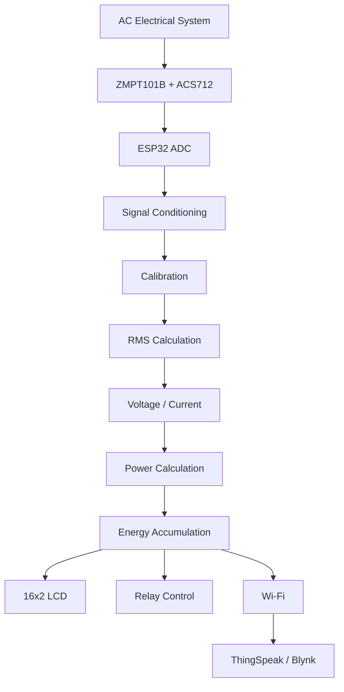

# Embedded IoT Architecture for Real-Time Electrical Energy Acquisition, Monitoring & Telemetry

**ESP32-Based IoT Smart Energy Monitoring and Load Control System**


An ESP32-based embedded IoT platform for electrical parameter acquisition,
power/energy processing, local display, wireless telemetry, and
relay-based load control.

---

## Overview

This project measures AC voltage and current using low-cost sensor
modules, processes the readings on an ESP32 to derive power and
accumulated energy, displays them on a local LCD, and streams them to a
cloud dashboard (ThingSpeak and/or Blynk) over Wi-Fi - while also
providing basic relay-based control of a connected load.

See [docs/PROJECT_OVERVIEW.md](docs/PROJECT_OVERVIEW.md) for the full
problem statement and objectives, and [docs/ABSTRACT.md](docs/ABSTRACT.md)
for a portfolio/academic-style abstract.

## Problem Statement

Consumers and small facilities often lack accessible, real-time
visibility into their electrical energy usage, making it hard to identify
waste or remotely control loads without expensive proprietary metering
hardware.

## Objectives

- Measure AC voltage (ZMPT101B) and AC current (ACS712ELC-20A)
- Process readings on an ESP32 to derive power and energy
- Display readings locally on a 16x2 I2C LCD
- Control a connected load via a relay, with a fail-safe OFF default
- Stream telemetry to ThingSpeak / Blynk over Wi-Fi

## Features

- Modular Arduino/ESP32 firmware (sensors, display, relay, energy,
  Wi-Fi, cloud, calibration as separate modules)
- RMS-based voltage/current calculation with configurable calibration
- Apparent power + accumulated energy (Wh/kWh) with NVS persistence
- 16x2 I2C LCD with rotating info screens
- Relay control with configurable active-high/low logic and fail-safe
  default-OFF startup
- Wi-Fi connection manager with automatic reconnect
- ThingSpeak telemetry (8 fields) and optional Blynk integration (7
  virtual pins)
- Interactive serial calibration routine
- Independent test sketches for every major hardware component

## Architecture



More diagrams: [diagrams/system_block_diagram.md](diagrams/system_block_diagram.md),
[diagrams/signal_flow.md](diagrams/signal_flow.md),
[diagrams/power_flow.md](diagrams/power_flow.md),
[diagrams/cloud_flow.md](diagrams/cloud_flow.md).

Full write-up: [docs/SYSTEM_ARCHITECTURE.md](docs/SYSTEM_ARCHITECTURE.md).

## Hardware

| Component | Qty | Purpose |
|---|---|---|
| ESP32 DevKit | 1 | Main controller |
| ACS712ELC-20A | 1 | AC current sensing |
| ZMPT101B | 1 | AC voltage sensing |
| JQC3F-05VDC-C relay module | 1 | Load switching |
| 16x2 I2C LCD | 1 | Local display |

Full BOM: [hardware/BOM.md](hardware/BOM.md)

## Software

| Category | Tools/Libraries |
|---|---|
| IDE | Arduino IDE (ESP32 board package) |
| Language | Embedded C/C++ |
| Connectivity | Wi-Fi (built-in ESP32) |
| Cloud | ThingSpeak, Blynk (optional) |
| Libraries | Wire, WiFi, LiquidCrystal_I2C, HTTPClient, Preferences, (Blynk if enabled) |

## Pin Table

| Function | Module | ESP32 |
|---|---|---|
| Voltage ADC | ZMPT101B OUT | GPIO34 |
| Current ADC | ACS712 OUT | GPIO35 |
| Relay control | JQC3F IN | GPIO26 |
| LCD SDA | I2C LCD | GPIO21 |
| LCD SCL | I2C LCD | GPIO22 |
| 5V | Power | 5V/VIN |
| Ground | Common low-voltage ground | GND |

Full details: [hardware/pinout.md](hardware/pinout.md),
[docs/PIN_CONNECTIONS.md](docs/PIN_CONNECTIONS.md)

## Working Principle

Sensors output analog signals proportional to instantaneous AC voltage
and current. The ESP32 samples both over a fixed time window, removes the
DC offset, and computes RMS values. These are combined into apparent
power (`S = Vrms x Irms`) and integrated over time into accumulated
energy. Results are shown on the LCD and periodically uploaded to the
configured cloud platform. See [docs/ENERGY_CALCULATION.md](docs/ENERGY_CALCULATION.md)
for the full power/energy math and its current limitations.

## Installation

### Arduino IDE setup

1. Install [Arduino IDE](https://www.arduino.cc/en/software).
2. Add the ESP32 board package (Boards Manager URL via
   File > Preferences, then install "esp32" in Boards Manager).
3. Select your ESP32 board under Tools > Board.
4. Select the correct COM/USB port under Tools > Port.
5. Install required libraries (see below) via Library Manager.
6. Copy `firmware/smart_energy_monitor/config.example.h` to `config.h`
   and fill in your own Wi-Fi/ThingSpeak/Blynk values.
7. Open `firmware/smart_energy_monitor/smart_energy_monitor.ino` and
   compile.
8. Upload to the ESP32.
9. Open Serial Monitor at 115200 baud.
10. Verify sensor data, LCD output, Wi-Fi connection, and cloud upload.

Full steps: [docs/TESTING.md](docs/TESTING.md),
[docs/WIFI_SETUP.md](docs/WIFI_SETUP.md)

### Library requirements

- `LiquidCrystal_I2C` (Library Manager)
- `Blynk` (only if `BLYNK_ENABLED` is set to 1 in `config.h`)
- Built-in ESP32 core libraries: `WiFi`, `HTTPClient`, `Wire`, `Preferences`

## Configuration

All configuration lives in `firmware/smart_energy_monitor/config.h`
(gitignored). Start from `config.example.h`:

```cpp
#define WIFI_SSID       "YOUR_WIFI_NAME"
#define WIFI_PASSWORD   "YOUR_WIFI_PASSWORD"
#define THINGSPEAK_API_KEY     "YOUR_THINGSPEAK_WRITE_API_KEY"
#define THINGSPEAK_CHANNEL_ID  "YOUR_CHANNEL_ID"
```

## Calibration

Voltage/current calibration constants are placeholders until you run the
calibration procedure. See [docs/SENSOR_CALIBRATION.md](docs/SENSOR_CALIBRATION.md) -
**do not skip the "disconnect mains / zero current" safety steps.**

## Testing

Independent test sketches live under `test/`: `relay_test`, `lcd_test`,
`acs712_test`, `zmpt101b_test`, `wifi_test`. Run each before the full
firmware. See [docs/TESTING.md](docs/TESTING.md) for documented results
and [docs/TROUBLESHOOTING.md](docs/TROUBLESHOOTING.md) for common issues.

## Cloud Setup

- ThingSpeak: [docs/THINGSPEAK_SETUP.md](docs/THINGSPEAK_SETUP.md)
- Blynk (optional): [docs/BLYNK_SETUP.md](docs/BLYNK_SETUP.md)

## Safety

**230V AC is dangerous and potentially fatal.** Read
[docs/SAFETY.md](docs/SAFETY.md) in full before working on any mains-side
wiring. Never build mains wiring on a breadboard; use proper insulation,
terminals, and an enclosure; have final mains wiring checked by a
qualified electrician.

## Limitations

See [docs/LIMITATIONS.md](docs/LIMITATIONS.md) for the full list. In
short: sensor calibration is not yet complete, real (power-factor-aware)
power is not yet implemented (apparent power is used as an
approximation), and this is not a certified energy meter.

## Future Enhancements

See [docs/FUTURE_ENHANCEMENTS.md](docs/FUTURE_ENHANCEMENTS.md) - includes
synchronized-sampling real power, power factor measurement, overcurrent/
overvoltage protection, MQTT/Home Assistant integration, OTA updates, a
custom PCB, and an enclosure.

## Project Status

**Prototype / Development**

**Completed:**
- ESP32 USB-powered development workflow
- Relay control tested and working
- ACS712 zero-current baseline tested (~2928-2942 raw ADC, ~2.36-2.37V)
- LCD / low-voltage subsystem testing

**Pending:**
- ZMPT101B calibration
- Full sensor calibration (voltage + current scale factors)
- Safe AC load testing
- Cloud telemetry validation under real load
- Final mains enclosure

See [docs/TESTING.md](docs/TESTING.md) for details.

## Screenshots

See [screenshots/](screenshots/) - placeholder folder, to be populated as
hardware testing progresses.

## Demo

Not yet recorded - this section will be updated once live-load testing
and cloud validation are complete.

## Author

**Project/Brand:** Techsmithlab

- Author: [SAMITH R]
- GitHub: [https://github.com/techsmithlab]
- LinkedIn: [https://www.linkedin.com/company/113026202/]
- Website: https://techsmithlab.com

## License

MIT - see [LICENSE](LICENSE).
