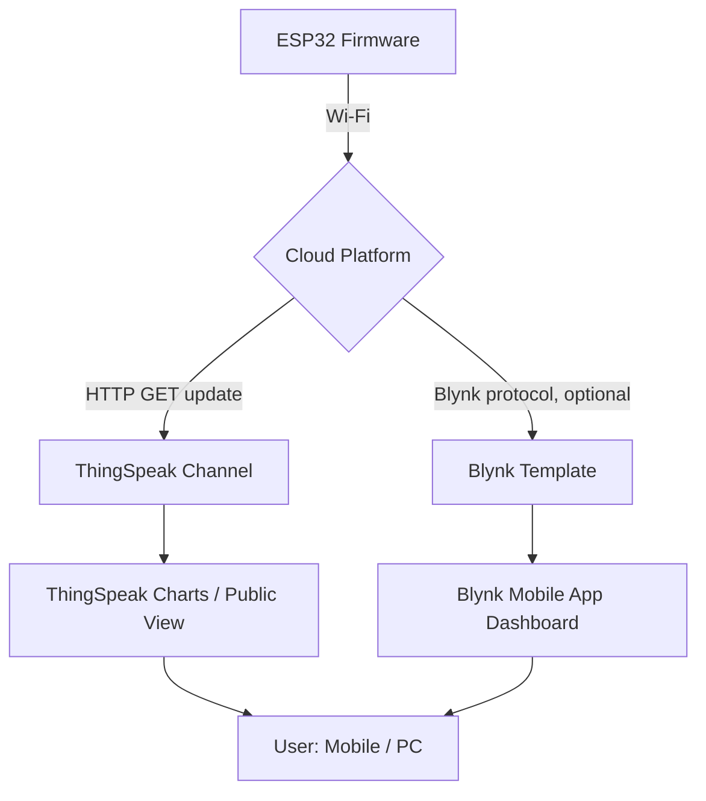

# Cloud / Telemetry Architecture

```mermaid
flowchart TD
    A[ESP32 Firmware] -->|Wi-Fi| B{Cloud Platform}
    B -->|HTTP GET update| C[ThingSpeak Channel]
    B -->|Blynk protocol, optional| D[Blynk Template]
    C --> E[ThingSpeak Charts / Public View]
    D --> F[Blynk Mobile App Dashboard]
    E --> G[User: Mobile / PC]
    F --> G
```

Fields / virtual pins used are documented in
[../docs/THINGSPEAK_SETUP.md](../docs/THINGSPEAK_SETUP.md) and
[../docs/BLYNK_SETUP.md](../docs/BLYNK_SETUP.md).
