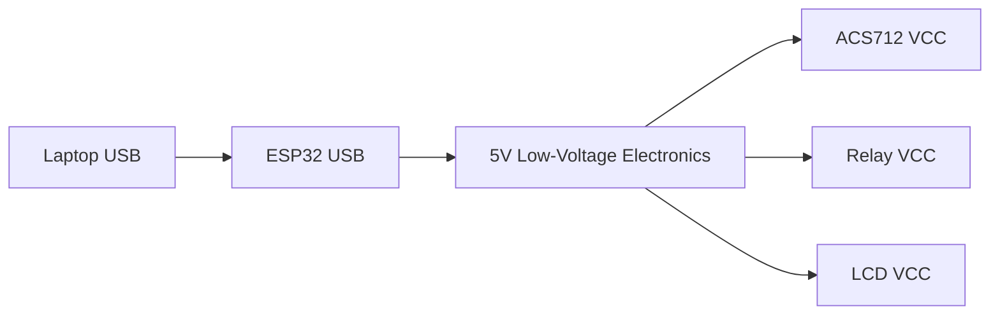
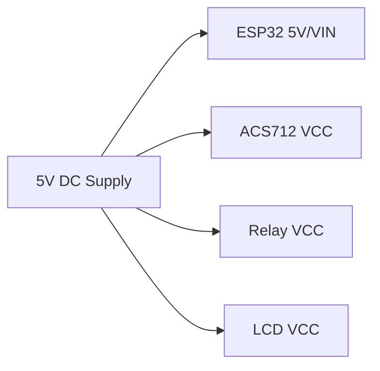
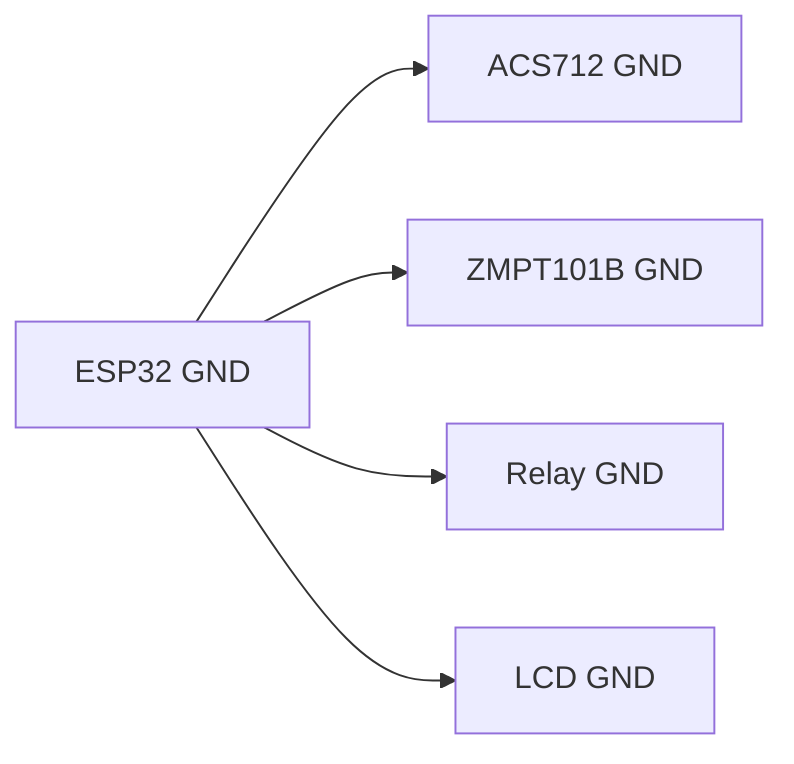

# Power Architecture Flow

## Development power (current status)

```mermaid
flowchart LR
    A[Laptop USB] --> B[ESP32 USB]
    B --> C[5V Low-Voltage Electronics]
    C --> D[ACS712 VCC]
    C --> E[Relay VCC]
    C --> F[LCD VCC]
```

## Alternative: regulated 5V rail

```mermaid
flowchart LR
    A[5V DC Supply] --> B[ESP32 5V/VIN]
    A --> C[ACS712 VCC]
    A --> D[Relay VCC]
    A --> E[LCD VCC]
```

## Common ground

```mermaid
flowchart LR
    G[ESP32 GND] --> C[ACS712 GND]
    G --> Z[ZMPT101B GND]
    G --> R[Relay GND]
    G --> L[LCD GND]
```

Protective earth (mains side) is never tied to this low-voltage ground.
