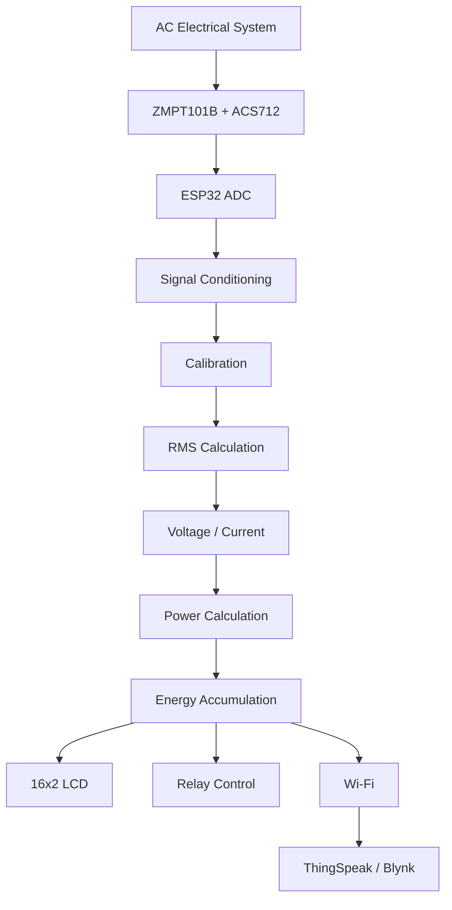

# Signal / Data Flow

```mermaid
flowchart TD
    A[AC Electrical System] --> B[ZMPT101B + ACS712]
    B --> C[ESP32 ADC]
    C --> D[Signal Conditioning]
    D --> E[Calibration]
    E --> F[RMS Calculation]
    F --> G[Voltage / Current]
    G --> H[Power Calculation]
    H --> I[Energy Accumulation]
    I --> J[16x2 LCD]
    I --> K[Relay Control]
    I --> L[Wi-Fi]
    L --> M[ThingSpeak / Blynk]
```
