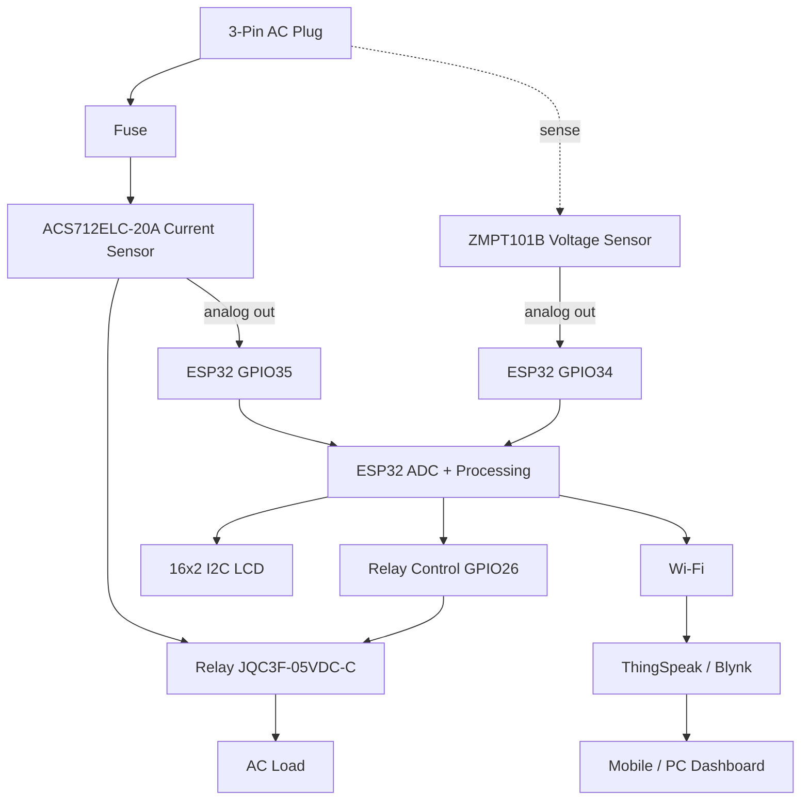

# System Block Diagram

```mermaid
flowchart TD
    A[3-Pin AC Plug] --> B[Fuse]
    B --> C[ACS712ELC-20A Current Sensor]
    C --> D[Relay JQC3F-05VDC-C]
    D --> E[AC Load]
    A -.sense.-> F[ZMPT101B Voltage Sensor]
    C -- analog out --> G[ESP32 GPIO35]
    F -- analog out --> H[ESP32 GPIO34]
    G --> I[ESP32 ADC + Processing]
    H --> I
    I --> J[16x2 I2C LCD]
    I --> K[Relay Control GPIO26]
    K --> D
    I --> L[Wi-Fi]
    L --> M[ThingSpeak / Blynk]
    M --> N[Mobile / PC Dashboard]
```
